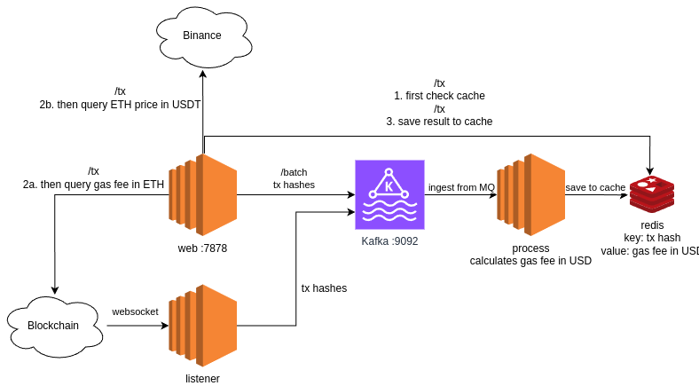

# Uniswap Trades Tracker



Relevant files for reading (ignore the rest, they were experimental)

```bash
src/process.rs     # for ingesting from MQ and processing and writing to cache
src/web.rs         # for serving API (/tx and /batch)
Dockerfile         # setup
docker-compose.yml # setup
```

## API Documentation

See Demo below for examples.

`/health`

Returns "OK" if the server is up.

`/tx/:hash`

- hash: hash of the uniswap tx

  Returns the gas fee in USDT (at time of trade), calculated using gas*used * gas*price * eth_usdt_price, where eth_usdt_price is fetched from binance.

`/batch?start_block=:start_block&end_block=:end_block`

- start_block: start block number
- end_block: end block number

  Starts a batch job to fetch all uniswap txs in the given range. Results are saved in cache for fast retrieval.

  Returns a list of tx hashes, in the format of

```bash
{
  "ok": true,
  "hashes": [
    "0x1234",
    "0x5678"
  ]
}
```

## Known Issues / TODO

- Can't detect mempool tx that are interacting (via internal tx) with uniswap
- Connection pooler for alloy provider

## Demo Setup

Tunnel to home network for geth full node. Or just use some public endpoint (features might be limited).

```bash
ssh -N -f -L 8546:localhost:8546 -L 8545:localhost:8545 user@ip
cp .env.example .env # replace with own stuff
docker compose up -d
docker exec --workdir /opt/kafka/bin/ -it broker ./kafka-topics.sh --bootstrap-server localhost:9092 --create --topic test-topic
docker compose up -d process web listener
```

## Demo Queries

If you're unable to setup, ask me on telegram @tch1001 for the IP.

Query the following endpoints

- [http://localhost:7878/tx/0xd01a5063a485cee4045fb6edad8a72329680604b5e4e62327b68aa470cd4c65c](http://localhost:7878/tx/0xd01a5063a485cee4045fb6edad8a72329680604b5e4e62327b68aa470cd4c65c) example for single tx, accuracy is demonstrated
- [http://localhost:7878/batch?start_block=20849592&end_block=20849592](http://localhost:7878/batch?start_block=20849592&end_block=20849592) for batch processing

## Unit Tests

```bash
cargo test
```

# =========================== FOR SELF ===========================

### Kafka

[https://hub.docker.com/r/apache/kafka](https://hub.docker.com/r/apache/kafka)

```bash
docker run -d --name broker apache/kafka:latest
# or
docker compose up -d
docker exec --workdir /opt/kafka/bin/ -it broker sh
./kafka-topics.sh --bootstrap-server localhost:9092 --create --topic test-topic
./kafka-console-producer.sh --bootstrap-server localhost:9092 --topic test-topic
./kafka-console-consumer.sh --bootstrap-server localhost:9092 --topic test-topic --from-beginning
brew install kafka
kafka-console-consumer --bootstrap-server localhost:9092 --topic test-topic
```

When dockerising

```bash
docker run -it --workdir /opt/kafka/bin/ --network micah_default nicolaka/netshoot bash
docker run -it --workdir /opt/kafka/bin/ --network micah_default apache/kafka bash
./kafka-topics.sh --bootstrap-server broker:9092 --create --topic test-topic
./kafka-console-producer.sh --bootstrap-server localhost:9092 --topic test-topic
docker exec --workdir /opt/kafka/bin/ -it broker ./kafka-topics.sh --bootstrap-server localhost:9092 --create --topic test-topic
docker compose up -d process
```

[https://github.com/confluentinc/examples/tree/7.7.0-post/clients/cloud/rust](https://github.com/confluentinc/examples/tree/7.7.0-post/clients/cloud/rust)

### Stress Testing (Part 1)

Use [https://github.com/BuoyantIO/slow_cooker](https://github.com/BuoyantIO/slow_cooker) on `endpoints.txt`.

```bash
cd ..
git clone https://github.com/BuoyantIO/slow_cooker
cd slow_cooker
go build
cp ../micah/endpoints.txt .
slow_cooker -qps 10 @endpoints.txt
```

Results:

- single threaded, without caching (one tx hash)

```
{
  "p50": 1192,
  "p75": 1246,
  "p90": 1640,
  "p95": 1815,
  "p99": 2009,
  "p999": 2009
}
```

- single threaded, with caching of decode_tx (one tx hash)

```
{
  "p50": 113,
  "p75": 115,
  "p90": 119,
  "p95": 122,
  "p99": 128,  -> latency from binance get usdt price
  "p999": 1160 -> This is the initial request time
}
```

- single threaded, with caching of decode_tx and binance eth_usdt_price (one tx hash)

```
{
  "p50": 3,
  "p75": 3,
  "p90": 4,
  "p95": 4,
  "p99": 4,
  "p999": 1472
}
```

Ramped up to 100 qps with concurrency 100 and got a few timeouts

```
{
  "p50": 4,
  "p75": 6,
  "p90": 14,
  "p95": 1110,
  "p99": 1117,
  "p999": 1386
}
```

###

## Rust C FFI (experimental)

```bash
cargo build
gcc src/web.c -o meow -ldashboard -L./target/debug
LD_LIBRARY_PATH=./target/debug ./meow
```

Current issue is the return types are not being converted correctly (Rust `f64` -> C `double`).

## Rust C++ FFI (broken)

We call rust from c++. This is done using a custom [build.rs](./build.rs).

```bash
cargo build
g++ target/cxxbridge/dashboard/src/main.rs.cc src/webserver.cpp -o meow -L./target/debug -ldashboard -I ./target/cxxbridge/dashboard/
LD_LIBRARY_PATH=./target/debug ./meow
```

I couldn't get parameters to work so I'm just gonna stick to C for now.
